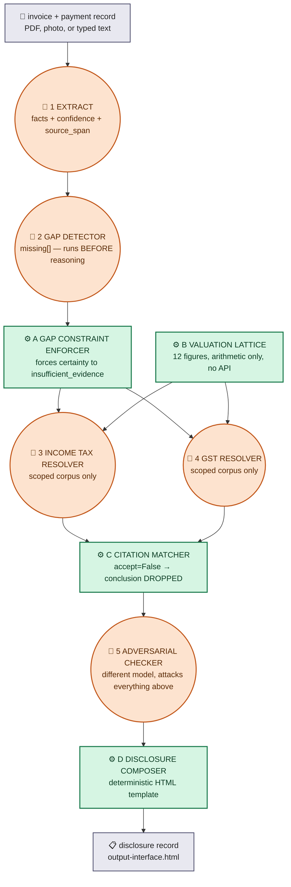

# FLOWCHART — DIVERGENCE, end to end
### Step 34 deliverable · written 21 August 2026
### Five model calls, four deterministic steps (three checks, one composer). Shapes below are load-bearing, not decoration.

---

## Why shape, not just colour

A judge's first question is usually *"why so many nodes?"* The honest
answer is not a number, it is a distinction: **some of these boxes can be
wrong, and some of them cannot, because they are not models.** Round boxes
below (🤖) are a model call — they read text and predict tokens, so they can
hallucinate. Square boxes (⚙) are ordinary Python — an `if` statement, a
string match, arithmetic — so they cannot invent anything, only enforce or
compute what was already there.

**One correction made while building this diagram:** `architecture.md`
(Step 19) says every failure below traces to a numbered entry in
`failure-catalogue.md`. That file does not exist as a separate document —
the F-numbers and their "what fails without this node" text live directly
inside `architecture.md` itself, under each node's own heading. The
references below point there, not to a file that was never actually split
out. Checked before writing this, not assumed from the older file's own
cross-reference.

---

## The diagram

**Legend:** 🤖 round = a model call, can be wrong. ⚙ square = ordinary code,
cannot invent. Grey = input/output, not a processing step.

---

## Node by node — what breaks without it, traced to `architecture.md`

| Node | One line | Fails without it (F-number, `architecture.md`) |
|---|---|---|
| 🤖 1 Extract | Pulls structured facts out of messy input, each one tagged with where it came from | F8 numeric/decimal confusion, F9 date normalisation, F10 entity confusion |
| 🤖 2 Gap detector | Establishes what is **absent** before anything reasons about what is present | F2 silent completeness — *predicted ~90%, the single highest-occurrence failure in the whole catalogue* |
| ⚙ A Gap enforcer | Forces `insufficient_evidence` on any conclusion that admits it depends on a missing fact — in code, not by asking nicely | Without it, F2 becomes a suggestion a fluent model can talk past |
| ⚙ B Valuation lattice | Enumerates all 12 defensible rupee figures by arithmetic, never picks one | F1 silent rate selection (highest RPN in the risk register, 125) · F11 weekend invention |
| 🤖 3 Income tax resolver | Resolves classification, recognition date, valuation method, TDS, penalty — scoped corpus, cross-regime citation structurally impossible | F6 regime collapse, F7 single-event tax, F4 inference stated as settled |
| 🤖 4 GST resolver | Resolves export-of-services status against IGST/CGST text only | Same regime-collapse family as 🤖 3, from the GST side |
| ⚙ C Citation matcher | String-matches every citation against real corpus text and the stated tax year; a miss drops the whole conclusion, not just a flag | F5 fabricated citation · F3 stale/year-less citation — caught 5 of this project's own historical errors automatically |
| 🤖 5 Adversarial checker | A **different model family** attacks every conclusion above, publishes the attack whether it lands or not | F4 false settledness — the only node built specifically to catch a real, current, correctly-quoted provision applied outside its own scope. Caught 3 real instances on unplanted data this project's own resolvers produced (D50, D54, D55) |
| ⚙ D Disclosure composer | Deterministic template — absence first, range second, single answer never | *"A document whose purpose is to be trustworthy cannot be produced by something that can hallucinate."* (`architecture.md`) |

---

## One thing this diagram cannot show, said here instead

`architecture.md`'s own warning box under 🤖 5 still reads *"this node has
never run."* That was true 19 August. It is not true now — node 5 has run
eight times as of `results.md`'s Block F (21 August), caught three real,
previously-undisclosed scope-reach errors in this project's own output
unprompted, and also produced two documented failures of its own (attacking
almost everything it sees; emitting incoherent output on one run). Both are
disclosed in `results.md`'s "Where we lose," not hidden because the node
also has real wins. This diagram shows the pipeline's shape, which hasn't
changed since 19 August; it does not show which claims about that shape are
now stale — `results.md` is where the current numbers live.
